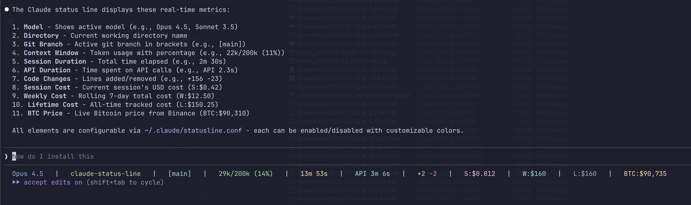

# Claude Code Status Line

A customizable status line for [Claude Code](https://claude.ai/code) that displays useful metrics at the bottom of your terminal.



## Features

Display real-time information while using Claude Code:

| Element | Color | Description |
|---------|-------|-------------|
| Model | Blue | Current model (e.g., "Opus 4.5") |
| Directory | Green | Current working directory |
| Git Branch | Cyan | Active git branch `[main]` |
| Context Window | Color-coded | Used/max tokens with percentage (e.g., `22k/200k (11%)`) |
| Session Duration | Yellow | Time spent in session |
| API Duration | Cyan | Time spent on API calls |
| Code Changes | Green/Red | Lines added/removed (`+1453 -226`) |
| Session Cost | Magenta | Current session cost (`S:$13.0`) |
| Daily Cost | Yellow | Today's total via ccusage (`D:$83.5`) |
| Weekly Cost | Cyan | This week's total via ccusage (`W:$212`) |
| Lifetime Cost | White | All-time total via ccusage (`L:$570`) |
| BTC Price | Yellow | Live Bitcoin price (`BTC:$90,387`) |

### Context Window Color Coding
- **Green**: < 50% used
- **Yellow**: 50-75% used
- **Red**: > 75% used

## Installation

### Quick Install

```bash
# Clone the repository
git clone https://github.com/born1337/claude-status-line.git

# Run the install script
cd claude-status-line
./install.sh
```

### Manual Install

1. Copy the status line script:
```bash
cp statusline-command.sh ~/.claude/statusline-command.sh
chmod +x ~/.claude/statusline-command.sh
```

2. Add to your Claude Code settings (`~/.claude/settings.json`):
```json
{
  "statusLine": {
    "type": "command",
    "command": "~/.claude/statusline-command.sh"
  }
}
```

3. Restart Claude Code to see the status line.

## Requirements

- [Claude Code](https://claude.ai/code) CLI
- `jq` for JSON parsing
- `bc` for cost calculations
- `git` (optional, for branch display)
- `ccusage` (optional, for daily/weekly/lifetime cost tracking)

### Install dependencies (macOS)
```bash
brew install jq bc
npm install -g ccusage  # Optional: for cost tracking
```

### Install dependencies (Ubuntu/Debian)
```bash
sudo apt-get install jq bc
npm install -g ccusage  # Optional: for cost tracking
```

## Configuration

The status line is fully configurable via CLI or config file.

### Using the CLI Tool

```bash
# View current configuration
statusline-config show

# Enable/disable elements
statusline-config disable btc       # Hide BTC price
statusline-config enable btc        # Show BTC price

# Change colors
statusline-config color model red
statusline-config color directory cyan

# Reset to defaults
statusline-config reset

# List all options
statusline-config list
```

### Config File

Edit `~/.claude/statusline.conf` directly:

```bash
# Elements (1=show, 0=hide)
SHOW_MODEL=1
SHOW_DIRECTORY=1
SHOW_GIT_BRANCH=1
SHOW_CONTEXT=1
SHOW_DURATION=1
SHOW_API_DURATION=1
SHOW_CODE_CHANGES=1
SHOW_SESSION_COST=1
SHOW_DAILY_COST=1
SHOW_WEEKLY_COST=1
SHOW_LIFETIME_COST=1
SHOW_BTC=1

# Colors
COLOR_MODEL=blue
COLOR_DIRECTORY=green
COLOR_DAILY_COST=yellow
COLOR_BTC=yellow
# ... and more

# Settings
BTC_CACHE_TTL=30
CCUSAGE_CACHE_TTL=60
```

### Available Colors

`black`, `red`, `green`, `yellow`, `blue`, `magenta`, `cyan`, `white`
`bright_black`, `bright_red`, `bright_green`, `bright_yellow`, `bright_blue`, `bright_magenta`, `bright_cyan`, `bright_white`

## Usage Tracking

Cost tracking is powered by [ccusage](https://github.com/ryoppippi/ccusage), which reads Claude Code's native usage logs.

### Cost Calculations
| Metric | Source |
|--------|--------|
| Session | Current session's `cost.total_cost_usd` from Claude Code |
| Daily | Today's total from ccusage |
| Weekly | This week's total from ccusage |
| Lifetime | All-time total from ccusage |

### Performance
- ccusage data is cached for 60 seconds (configurable via `CCUSAGE_CACHE_TTL`)
- BTC price is cached for 30 seconds (configurable via `BTC_CACHE_TTL`)
- First status line render may take ~2s while caches warm up
- Subsequent renders are ~50ms

## Example Output

```
Opus 4.5 | claude-status-line | [main] | 22k/200k (11%) | 3h 20m | API 23m 0s | +1453 -226 | S:$13.0 | D:$83.5 | W:$212 | L:$570 | BTC:$94,000
```

## Available Data Fields

The status line receives JSON data from Claude Code with these fields:

```json
{
  "model": { "display_name": "Claude 4.5 Opus" },
  "workspace": {
    "current_dir": "/path/to/project",
    "project_dir": "/path/to/project"
  },
  "session_id": "uuid",
  "context_window": {
    "context_window_size": 200000,
    "current_usage": { "input_tokens": 15000 },
    "total_input_tokens": 50000,
    "total_output_tokens": 8000
  },
  "cost": {
    "total_cost_usd": 0.55,
    "total_duration_ms": 330000,
    "total_api_duration_ms": 45200,
    "total_lines_added": 156,
    "total_lines_removed": 23
  }
}
```

## Querying Your Data

Use ccusage directly for detailed usage reports:

```bash
# Daily breakdown
ccusage daily

# Weekly breakdown
ccusage weekly

# By session
ccusage session

# JSON output for scripting
ccusage daily --json | jq '.totals.totalCost'
```

## Troubleshooting

### Status line not appearing
1. Ensure the script is executable: `chmod +x ~/.claude/statusline-command.sh`
2. Check settings.json syntax is valid JSON
3. Restart Claude Code

### Missing data
Some fields (like `cost.total_cost_usd`) may not be available depending on your Claude Code version or authentication method.

### Costs show $0
If daily/weekly/lifetime costs show $0:
1. Ensure ccusage is installed: `npm install -g ccusage`
2. Verify it works: `ccusage daily`
3. Clear the cache and try again: `rm /tmp/claude-ccusage-cache`

## Contributing

Contributions welcome! Feel free to:
- Add new display elements
- Improve formatting/colors
- Fix bugs
- Add documentation

## License

MIT License - see [LICENSE](LICENSE) file.

## Credits

Created with Claude Code. Inspired by the need to monitor Claude usage at a glance.
